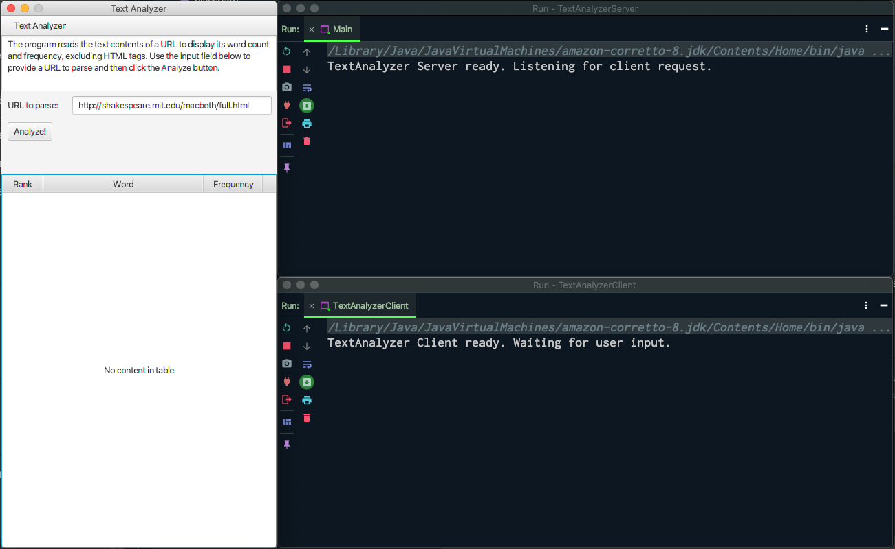
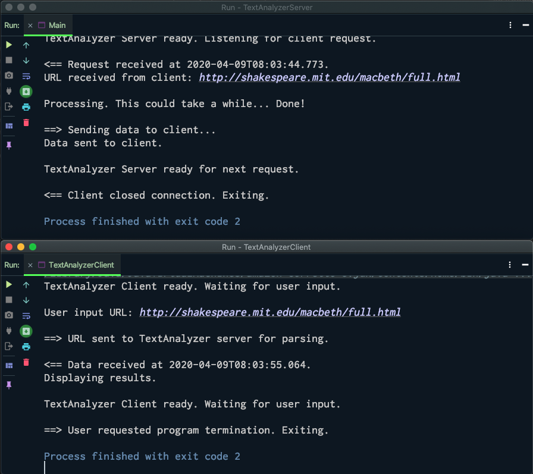
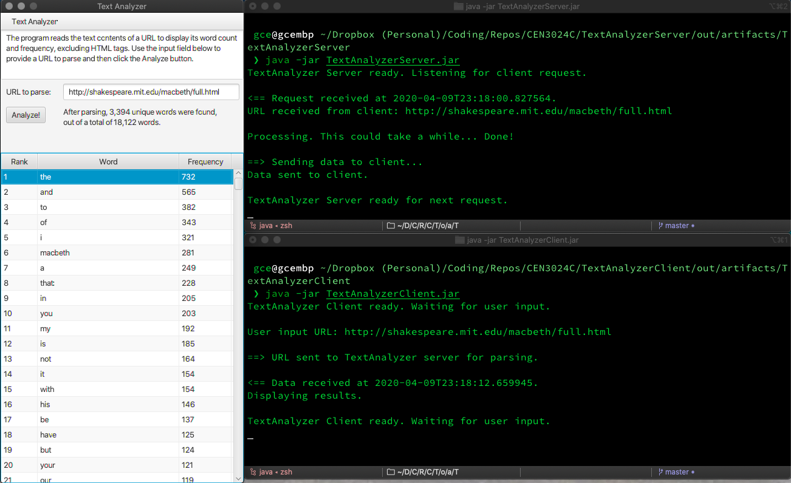
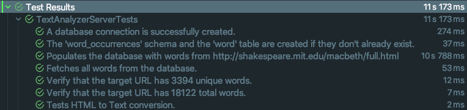

# TextAnalyzer Server
Go to [TextAnalyzer Client](https://github.com/qstainless/TextAnalyzerClient).

## Overview
This is the server application of my [TextAnalyzer](https://github.com/qstainless/TextAnalyzer) program. The server opens a socket to accept incoming connections from the [client application](https://github.com/qstainless/TextAnalyzerClient).

## What does this program do?
When run, the server is ready to accept connections from the client application. Once it receives a URL from the client application, the server will parse the URL and send back the statistics to the client application, which will then display the results in a GUI (Graphical User Interface).

## Code design
For this exercise, the [TextAnalyzer](https://github.com/qstainless/TextAnalyzer) program was split into two parts: a client application and this server application. The client application presents the user with the GUI, interacts with the server application to process the URL submitted by the user, and then displays the data processed and sent back by the server.

For additional code design notes, see the TextAnalyzer [Code Desing](https://github.com/qstainless/TextAnalyzer#code-design) section.

## Test plans and standards
The client and server applications were built upon the existing TextAnalyzer code base. The program was not developed initially using TDD (Test Driven Development) standards. In other words, the code and expected output were not tested formally. Testing was done incrementally, that is, after each completed minor change, typically after each line of code was added, mainly to catch compile-time and runtime errors not previously detected and highlighted by the IDE.

As of version 1.7, the program includes unit tests created using Junit.

## System requirements
The program is a JavaFX application using version 8 of Amazon's distribution of the Open Java Development Kit (OpenJDK) [Corretto 8](https://aws.amazon.com/corretto/), which includes JavaFX 8. Unit tests were created using [Junit 5](https://github.com/junit-team/junit5/).

## Database connection defaults
The program assumes that an existing database user with all database privileges in the local MySQL database with username/password: textanalyzer/textanalyzer. It also assumes that it will connect to localhost using default port 3306. However, the user may change these initial configuration options by editing lines 32 to 35 in the `Database` class: 

```
/src/gce/textanalyzer/controller/Database.java

32    String databaseHost = "localhost";
33    String databasePort = "3306";
34    String databaseUser = "textanalyzer";
35    String databasePass = "textanalyzer";
```

## How to use this program.
The server application requires no user interaction other than compilation adn execution. It must be run before the client application runs.

## Installation.
To install the program, simply clone the repo, open it in your favorite IDE, and run it. Make sure that Java JDK 8 and JavaFX 8 are installed in your system. For convenience, I have created the files needed for importing the project into Eclipse.

## Known Issues
Not all HTML files are created equal. The program's code to convert HTML files to plain text is still rudimentary, as it is unable to identify HTML tag properties in lines without opening or closing tags.

For example, in the following code:

```html
<div class="Popover anim-scale-in js-tagsearch-popover"
     hidden
     data-tagsearch-url="/qstainless/TextAnalyzer/find-symbols"
     data-tagsearch-ref="master"
     data-tagsearch-path="README.md"
     data-tagsearch-lang="Markdown">
</div>
```

The following will be considered as 'words' by the program because the lines do not begin with "<" nor end with ">."

```html
     hidden
     data-tagsearch-url="/qstainless/TextAnalyzer/find-symbols"
     data-tagsearch-ref="master"
     data-tagsearch-path="README.md"
```

That is because the program parses the target URL line by line. Lines that begin with "<" or end with ">" are ignored for purposes of counting words in them. 

## Todo
Refactor the `countWordFrequencies` method to detect lines that begin with "<" and ignore all following lines up to and including the next line with a closing ">." Because the parser will ignore the lines, there will be no need to call the `htmlToText` method.

## Version history
The version numbering of this project does not follow most version numbering guidelines. Instead, it is limited to a two-token concept:

```(major).(course module)``` 

```
Version 1.11 (current) - Converted program into server/client
Version 1.10 - Added database support
Version 1.9 - Added JavaDocs
Version 1.7 - Added unit tests using JUnit
Version 1.6 - Added GUI functionality
Version 1.2 - First version
```

## Screenshots
### Program running

### Displaying results

### Program termination

### Running from the command line


## Unit Tests

